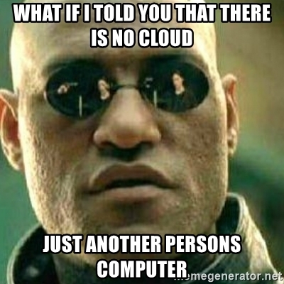
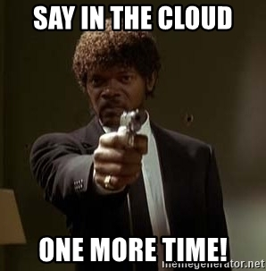

# Buzzwords 1: Cloud

- [Buzzwords 1: Cloud](#buzzwords-1-cloud)
  - [What is the cloud?](#what-is-the-cloud)
  - [Some Terms](#some-terms)
    - [Scaling](#scaling)
      - [Load balancing](#load-balancing)
    - [The Cloud](#the-cloud)
    - [The Edge](#the-edge)
    - [On-Premises](#on-premises)
    - [Infrastructure as a Service (IaaS)](#infrastructure-as-a-service-iaas)
    - [Software as a Service (SaaS)](#software-as-a-service-saas)
    - [Platform as a Service (PaaS)](#platform-as-a-service-paas)
    - [Backend as a Service (BaaS)](#backend-as-a-service-baas)
    - [Function as a Service (FaaS) / Serverless](#function-as-a-service-faas--serverless)
  - [Why rent someone else's computer?](#why-rent-someone-elses-computer)
    - [Public and Private Cloud](#public-and-private-cloud)
      - [Public Cloud](#public-cloud)
      - [Private Cloud](#private-cloud)
      - [Hybrid Cloud](#hybrid-cloud)
      - [Multi Cloud](#multi-cloud)
  - [Cloud service models](#cloud-service-models)
  - [Cloud concepts / tech](#cloud-concepts--tech)
    - [Virtualization](#virtualization)
    - [Containerization](#containerization)
    - [Orchestration](#orchestration)
    - [Software defined infrastructure](#software-defined-infrastructure)
  - [How it works](#how-it-works)
  - [Downsides?](#downsides)
    - [Vendor lock-in](#vendor-lock-in)
  - [Jobs](#jobs)
  - [Resources](#resources)

## What is the cloud?

It's someone else's computer?

Cloud computing is an on-demand, utility-based model of computing.

## Some Terms

### Scaling

- Horizontal - More instances
- Vertical - More CPU and RAM

#### Load balancing

When scaling horizontally, you need to make sure that the traffic and load is shared across instances. That's where load balancers come in. Most cloud platforms which offer horizontal scaling will have load balancers to take care of that for you.

### The Cloud

### The Edge

### On-Premises

Buy servers, rack 'em, stack 'em.

### Infrastructure as a Service (IaaS)

Example: Virtual Machines (AWS EC2, Azure VM), Storage (AWS S3, Azure Blob Storage)

### Software as a Service (SaaS)

Example: Dropbox

### Platform as a Service (PaaS)

If you have an app that needs a webserver and a database, the cloud provider takes are of configuration. You bring the code. The provider takes care of provisioning, configuration, security, and scale.

Example: Azure App Service, Heroku, AWS Elastic Beanstalk, Google App Engine

### Backend as a Service (BaaS)

The cloud provider handles backend. Real time apps with user auth with no backend code 😉.

Example: AWS Amplify, Google Firebase

### Function as a Service (FaaS) / Serverless

FaaS is a way of providing backend servers on a as-used basis. Instead having your service run all the time and paying by the amount of time, you can pay ny the number of times your code is run and how many compute units it consumes.

Example: AWS Lambda, Azure Functions

## Why rent someone else's computer?

*Why rent another person's home? Why rent a car?*

*Why is everyone and their moms moving to and developing on "the cloud"?*

The answer to all of those questions is money 💰 or lack thereof.

It more economical to let someone else buy/upgrade/replace land, buildings, servers, bandwidth and hire/manage staff to maintain those things than to do it your self.

It is also easier to scale, handle spikes and drops in demand with cloud computing.

### Public and Private Cloud

#### Public Cloud

Cloud where you can just sign up with an email and credit-card.

#### Private Cloud

You run services with cloud computing paradigms on your own hardware.

#### Hybrid Cloud

Mix of public and private cloud.

#### Multi Cloud

Mix of public cloud. For example: using both Azure and AWS to host services.

## Cloud service models

| Component      | On-Premises | Infrastructure as a Service (IaaS) | Platform as a Service (PaaS) | Software as a Service (SaaS) |
| -------------- | ----------- | ---------------------------------- | ---------------------------- | ---------------------------- |
| Application    | ❌           | ❌                                  | ❌                            | ✅                            |
| Data           | ❌           | ❌                                  | ❌                            | ✅                            |
| Security       | ❌           | ❌                                  | ✅                            | ✅                            |
| Runtime        | ❌           | ❌                                  | ✅                            | ✅                            |
| Middleware     | ❌           | ❌                                  | ✅                            | ✅                            |
| OS             | ❌           | ❌                                  | ✅                            | ✅                            |
| Storage        | ❌           | ✅                                  | ✅                            | ✅                            |
| Networking     | ❌           | ✅                                  | ✅                            | ✅                            |
| Servers        | ❌           | ✅                                  | ✅                            | ✅                            |
| Virtualization | ❌           | ✅                                  | ✅                            | ✅                            |
| Data Centers   | ❌           | ✅                                  | ✅                            | ✅                            |

❌ Your problem

✅ Someone else's problem

## Cloud concepts / tech

### Virtualization

### Containerization

### Orchestration

### Software defined infrastructure

## How it works

## Downsides?

### Vendor lock-in

Case study: Dropbox move to on-prem.

Dropbox cut expenses by at least 75,000,000.

## Jobs

What does a cloud engineer do?

They architect, build, and maintain cloud resources while optimizing cost, and performance.

Cloud Engineer tech stack:
  1. Cloud services for your vendor (Azure, AWS, etc..)
  2. Linux
  3. Terraform
  4. Ansible
  5. Python / Node.js / Go
  6. Kubernetes
  7. Jenkins
  8. Networking
  9. Git

---

## Resources

- [Cloud Concepts - Principles of cloud computing](https://docs.microsoft.com/en-us/learn/modules/principles-cloud-computing/)

